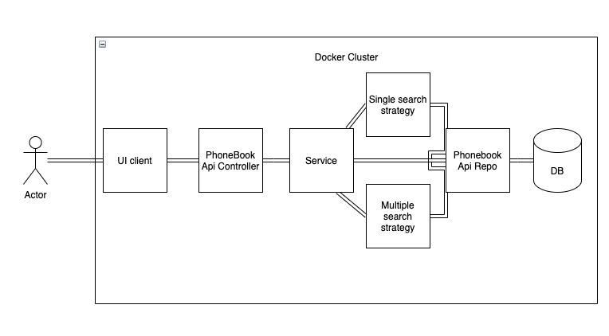

### Diagram

### Explanation

The solution basically is a REST api based off Spring JDBC, to create, delete, update, and list contacts based on personalized seraches that can match the first name, the last name, or the phone number of a contact. The api could be developed using JPA, because is easier, but the decision of using Spring JDBC, is to gain more control over the repository, and also because during the interviewing process I was told that the team was using Spring JDBC instead of JPA. 

On the other hand, the client is a client built in React which uses Redux, Material UI,  Axios among the most relevant technologies. The architecture of the solution is a layered architecture, shich uses Strategy, Builder and Singleton patterns in the api as the most relevant design patterns to distribute the workload among the different tasks that needed to be performed. 

In order to run the solution, please navigate from the root of the folder of this repository to `cd /Docker` and run the command `docker compose up`, if you want to see the logs and `docker compose up -d` if you do not want to see the logs of the current solution.

The ports that are exposed by the different layers are the following ones, in case that you decide to test that in your local machine:
* Client: `localhost:3000`
* API: `localhost:9000`
* DB: `localhost:5435`
* TEST DB: Random port, you can chek that out by looking at the exposed port of the postgres DB container, using `docker ps` command.

Thanks :)
